# Rekola Mobile-API

 - strojová dokumentace + mock api na apiary: http://docs.rekolacz.apiary.io/
 - pro pokročilejší vývoj aplikace poskytneme přístup na plně funkční dev-API
 - pull-requesty: editovat části v `parts/`, a poté zkompilovat pomocí `_compile.php`. Po přijetí pull-requestu se automaticky přenese na apiary.

## Dokumentace mobilní aplikace Rekola

Společné pro každý request:
 - hlavička `X-Api-Key: token`, který uživatel získal po přihlášení.
 - hlavička `X-Api-Version: 1.0.0`, pokud server zjistí nekompatiblitu vrací **426 Upgrade Required**
 - hlavička `Accept-Language: jazyk`, dle http specifikace např. `en;q=0.8,cs;q=0.6,en-us` 
 - hlavička `Client-Os: android 17`
 - **401 Unauthorized** pokud přihlašovací token není platný (např. session timeout).
 - **400 Bad Request** + `{"message": "popis chyby"}` pokud API obdrží nevalidní JSON (případně bez správných vlastností)

### 1. Přihlášení do aplikace

> **[POST /accounts/mine/login](http://docs.rekolacz.apiary.io/#post-%2Fapi%2Faccounts%2Fmine%2Flogin)** + `{"username": "xxx","password": "yyy"}`  
> **200 OK** + `{"apiKey": "token"}`  
> • úspěch, otevře se Hometab  
> **401 Unauthorized** + `{"message": "zpráva s vysvětlením"}`  
> • chyba různého typu (špatný login, vypršení účtu, ...), též pokud vyprší ApiKey  
> • zobrazit login screen s chybovou hláškou

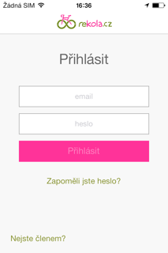 - 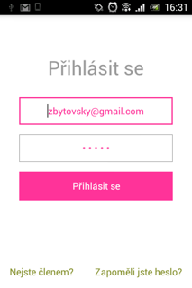

### 2. Obnovení hesla

> **[PUT /password-recovery]()** + `{"email": "xxx"}`  
> **200 OK**  
> • úspěch, mail byl poslán  
> **404 Not Found**  
> • registrovaný uživatel nenalezen  

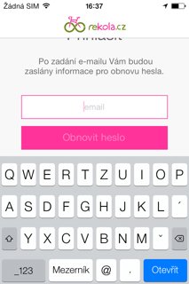 - 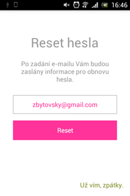

### 3. Hometab - odemčení kola / půjčené kolo

Nejdříve musí aplikace zjistit, jestli má uživatel půjčené kolo:

> **[GET /bikes/mine](http://docs.rekolacz.apiary.io/#get-%2Fapi%2Fbikes%2Fmine)**  
> **200 OK** + `<borrowed-bike-json + bikeCode + lockCode>`  
> • Uživatel má půjčené kolo, zobrazit screen "půjčené kolo"  
> **404 Not Found**  
> • uživatel nemá kolo = může půjčovat:

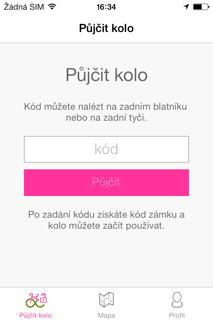 - 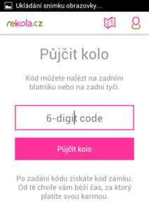

Po zadání 6-místného kódu kola získáme kód zámku: 

> **[GET /bikes/lock-code?bikeCode=123456&lat=50&lng=14](http://docs.rekolacz.apiary.io/#bikespjenkola)**  
> • lat,lon obsahují přesnou polohu z GPS (kvůli statistikám)  
> **400 Bad Request**  
> • špatný kód kola  
> **409 Conflict**  
> • toto kolo má už někdo půjčené, jen je asi zaparkované venku  
> **403 Forbidden**  
> • uživatel má už jedno kolo půjčené  
> **200 OK**  
> • Úspěch, zobrazíme screen "půjčené kolo":

#### Screen - půjčené kolo

Tento screen obsahuje tzv. web-view. Abychom nemuseli kvůli každé úpravě měnit všechny aplikace, část je vykreslená jako webová stránka, kterou přímo posílá API. Zde se jedná o proužek s názvem kola a textem "půjčeno". Adresa je:

> **[GET /bikes/{id}/status-webview?apikey={token}]()**  

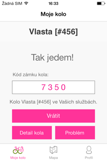 - 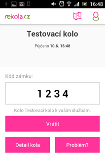

Nyní můžeme zobrazit detail kola, nebo kolo vrátit.

#### Screen - detail kola

Tato stránka je čisté web-view. Pozor ovšem, obsahuje odkaz na stránku issues, kde se volá api-požadavek pomocí javascriptu.

> **[GET /bikes/{id}/info-webview?apikey={token}]()**  

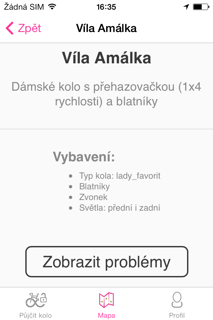 - 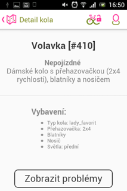

#### Screen - vrácení kola

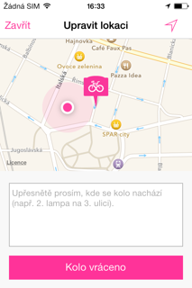 - 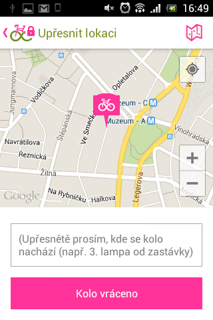

Zobrazuje mapu, kde je uprostřed fixed ikona polohy. Dole je pole pro textové upřesnění polohy. Odkliknutí pošle:

> **[PUT /bikes/{id}/return](http://docs.rekolacz.apiary.io/#bikesvrcenkola)** + `{"location":{"lat":50,"lng":14,"note":"Zábradlí"}}`  
> **403 Forbidden**  
> • uživatel vrací {id}, které nemá půjčené (to může jen admin)  
> **200 OK** + `{"successUrl":"http://...?foo=bar&apikey=token"}`  
> • Úspěch, zobrazíme fullscreen webview s url successUrl:

Toto webview přejde přesně na předanou adresu (včetně tokenu), dále je nutno odchytnout kliknutí na odkaz `?dismiss_view` pro zavření tohoto fullscreenu. Odkaz je typu `<a href="?dismiss_view">`.

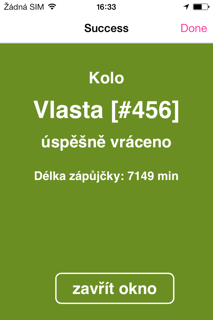 - 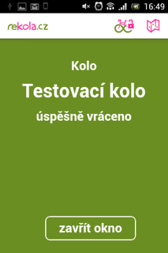

### 4. Tab - mapa

Na mapu se lze přepnout kdykoliv, ikdyž mám zrovna půjčené kolo. Výpis všech kol získám takto:

> **[GET /bikes/all?lat=50&lng=14](http://docs.rekolacz.apiary.io/#bikes)**
> **200 OK** + `[<bike-json>, ...]`  
> • Pošle všechna kola seřazená dle vzdálenosti od lat/lng

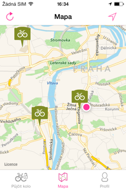 - 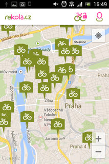

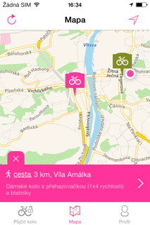 - 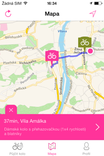 - 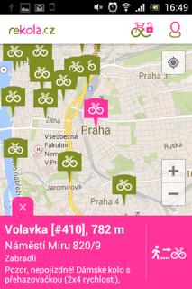

### 5. Tab - uživatel

Klasický web-view jako u detailu kola. Je zde ještě odkaz na "about page". Webview odchytává kliknutí na odkaz `?log_out` pro odhlášení.

> **[GET /accounts/mine/profile-webview?apikey={token}]()**  

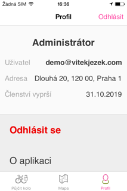 - 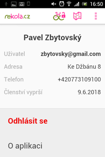

